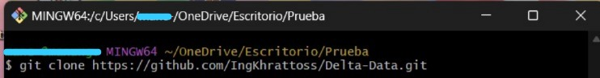
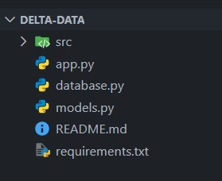
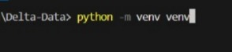
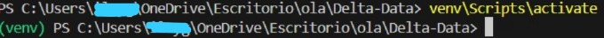
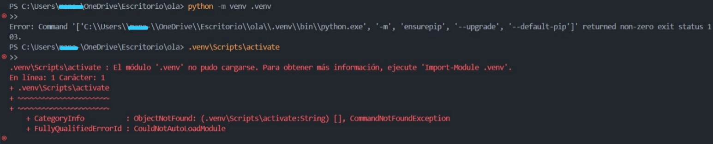
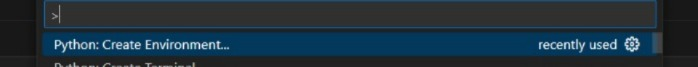
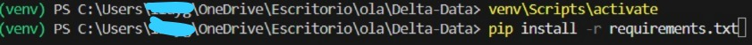
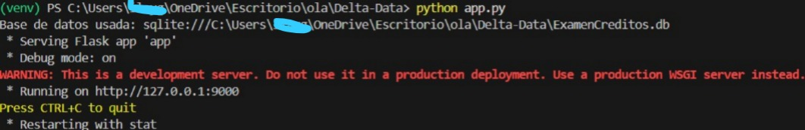

# Titulo del Proyecto
Examen Practico de Delta Data

## Descripcion
Este proyecto consiste en la creacion de un programa el cual tiene las funciones un CRUD, donde se podran registrar , actualizar, eliminar y consultar clientes que pidan creditos.

## Instalacion
Para instalar el proyecto se debe seguir los siguientes pasos:
1. Clonar el repositorio en la carpeta deseada usando el comando en la consola de git bash:
    -git clone https://github.com/IngKhrattoss/ExamenPracticoDeltaData.git
    Ejemplo: 
2. Abrir la carpeta del proyecto en el IDE o editor de texto de preferencia.
    Ejemplo: 
3. Crear un entorno virtual para que no tengas problemas con tu liberias, con el comando:
    -python -m venv venv
    Ejemplo: 
4. Despues activamos el entorno virtual con el comando:
    -venv\Scripts\activate (Windows)
    -source venv/bin/activate (Linux/Mac)
    Ejemplo: 
    4. 1. Si te sale un error al tartar de crear el entorno virtual, es posible que ya tengas creado un entorno virtual, entonces lo que debes hacer es borrarlo, despues volver a crearlo y activarlo.
    Ejemplo: 
    4. 2. Vamos a crear el entorno virtual y activarlo, seleccionamos la barra de busqueda para colocar el comando y ejecutarlo. ">Python" y seleccionamos "Create:Envirnoment"
    Ejemplo: 
    4. 3. Despues volvemos activar el entorno virtual.
    Ejemplo: 
5. Instalar las dependencias necesarias con el comando:
    -pip install -r requirements.txt
    Ejemplo: 
6. Finalmente, ejecutar el proyecto con el comando:
    -python app.py
    Ejemplo: 
    
## 🚀 Tecnologías utilizadas
- Python 3 version (3.12.1)
- Flask
- SQLite3
- SQLAlchemy
- Chart.js (para las gráficas)
- Bootstrap (para el diseño del frontend)

